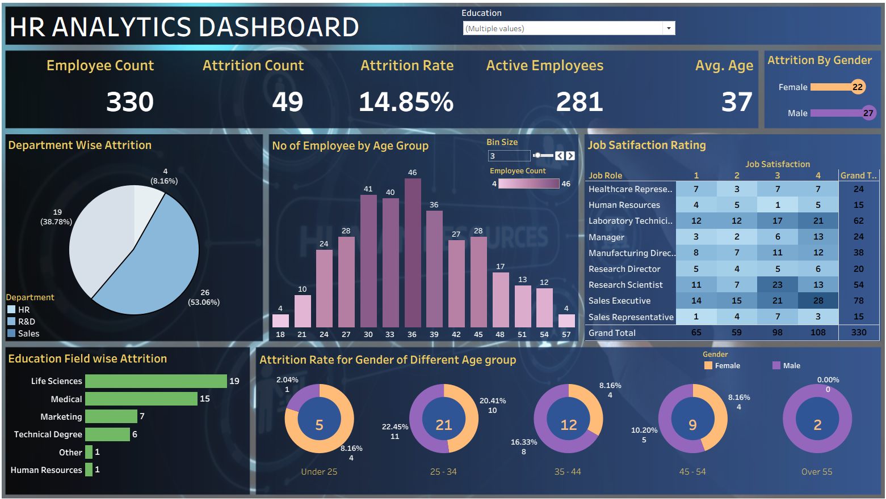

# 📊 HR Analytics Dashboard

An interactive **HR Analytics Dashboard built using Tableau** to analyze employee attrition, workforce demographics, job satisfaction, and education-related insights.

## 📌 Dashboard Preview

## 📈 Key Metrics

| Metric | Value |
|---|---:|
| 👥 Employee Count | 330 |
| ❌ Attrition Count | 49 |
| 📉 Attrition Rate | 14.85% |
| ✅ Active Employees | 281 |
| 🎂 Average Age | 37 |

## 🔍 Dashboard Features

The dashboard provides insights into:

- 📊 Department-wise employee attrition
- 👥 Employee distribution by age group
- 🚻 Attrition by gender
- ⭐ Job satisfaction rating by job role
- 🎓 Education field-wise attrition
- 📈 Attrition rate by gender across different age groups
- 👨‍💼 Overall employee, attrition, and active employee KPIs

## 🛠️ Tools & Technologies

- **Tableau** – Data visualization and dashboard development
- **HR Analytics Dataset** – Employee and attrition analysis
- **GitHub** – Version control and project sharing

  
## 🎯 Project Objective

The objective of this project is to transform HR data into an interactive Tableau dashboard that provides meaningful insights into **employee attrition, workforce demographics, job satisfaction, departments, and education fields**.

The dashboard helps users understand employee trends and identify patterns related to attrition.

## 📊 Dashboard Sections

### 1. Employee Overview
Displays key HR metrics such as:

- Total Employees
- Attrition Count
- Attrition Rate
- Active Employees
- Average Age

### 2. Department-wise Attrition
Shows the distribution of employee attrition across different departments such as:

- HR
- R&D
- Sales

### 3. Age Group Analysis
Visualizes the number of employees across different age groups.

### 4. Gender Analysis
Shows attrition distribution between male and female employees.

### 5. Job Satisfaction
A heatmap represents job satisfaction ratings across different job roles.

### 6. Education Field Analysis
Displays attrition across different education fields including:

- Life Sciences
- Medical
- Marketing
- Technical Degree
- Other
- Human Resources

### 7. Age & Gender Attrition Analysis
Shows attrition rates for different gender groups across various age categories.

## 📷 Dashboard Preview

## 🚀 How to Use

1. Download or clone this repository.
2. Open `HR ANALYTICS DASHBOARD.twb` using Tableau.
3. Explore the interactive dashboard.
4. Use the **Education** filter and other dashboard interactions to analyze the data.

## 👩‍💻 Author

### Aanchal Tripathi

---

⭐ If you find this project useful, feel free to explore the repository and give it a star!
